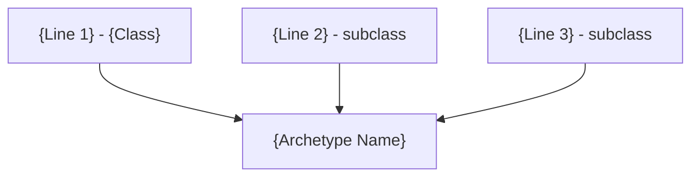
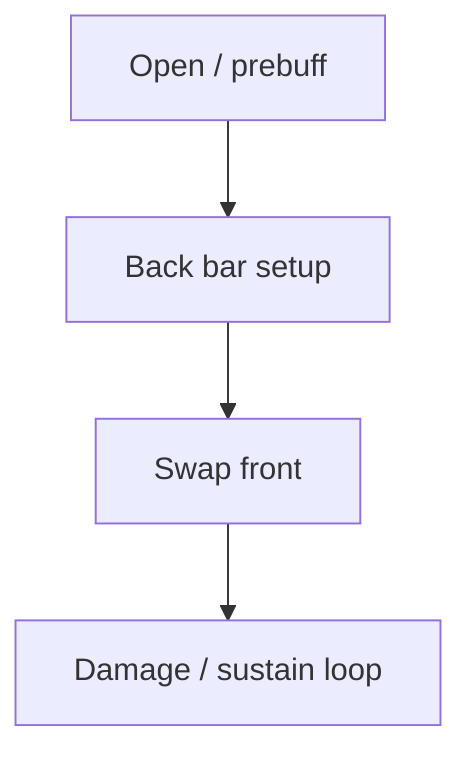
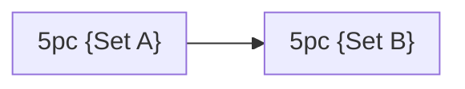

# Build Plan - {CharacterName}: {Archetype Title} ({Build Tag})

> **Character profile:** [{slug}.md](../{account}/{location}/{slug}.md) — Level {N} {Race} {Class}, CP {budget}, @{Account} ({Server}).

{One to two paragraphs: elevator pitch — what this build is, which subclass lines merge, what content it targets (solo overland, PvP, tank, etc.), and any live-vs-target transition note.}

---

## Build at a glance

| **Attribute** | **Recommendation** |
| :--- | :--- |
| **Primary Stat** | 64 points in **{Stat}** — **live:** {current spread/pools} · **target:** {pools at CP160} |
| **Mundus Stone** | **{Mundus}** — {why}; **live:** {equipped or changing} |
| **Vampirism** | **{Cured / Stage N / N/A}** — {rationale if relevant} |
| **Sets** | **{Set A + Set B}** (100% craftable unless exception documented) — **live:** {current} · **target:** {end state} |
| **Bars** | Front: {weapon} ("{bar name}") · Back: {weapon} ("{bar name}") |
| **Food** | **{Food}** |
| **Potion** | **{Potion}** |
| **Weapon Poisons** | {poisons if applicable} |
| **Staff/Weapon Enchant** | Front: {enchant}; Back: {enchant} |
| **Companion** | **Primary (now):** **{Name}** ({role}) at live CP **{budget}** + companion **{N}/20** · **Secondary:** **{Name}** ({one-line why}) · **Goal (20/20 @ CP160):** **{Name}** ({role}) |
| **Primary Mount** | **{Owned mount}** (owned) · **Ideal:** **{Ideal mount}** — see [Collectibles](#collectibles) |
| **Flavor Pet** | **{Owned pet}** (owned) · **Ideal:** **{Ideal pet}** — see [Collectibles](#collectibles) |

**Read next:** [Roleplay](#roleplay-{anchor-slug}) · [Trinity configuration](#trinity-configuration) · [Combat kit](#combat-kit-{anchor-slug}) · [Gear and crafting](#gear-and-crafting-{anchor-slug}) · [Champion points](#champion-point-mapping-cp-{budget}) · [Companion](#companion-strategy-{anchor-slug}) · [Collectibles](#collectibles) · [Checklist](#next-steps--in-game-action-checklist)

---

## Roleplay: {Identity Title}

{Character identity prose — who they are in Tamriel, how the build reads in fiction.}

> [!TIP]
> **Suggested Custom Title:** `{≤100 characters for LAM Custom Title}`

> [!NOTE]
> **Build Notes (paste into LAM Custom Title / Build Notes):**
> {≤1,900 character summary: archetype, sets, bars, subclass lines, attributes, mundus, companion, crafter, CP focus — single paragraph or tight bullets.}

> [!TIP]
> **Flavor Pet:** **{Best owned pet}** from the character's Collectibles export. **Ideal (any source):** **{Ideal pet}** — see [Collectibles](#collectibles) for mount, pet, and dye details.

---

## Trinity configuration

By completing Bahtra at-Hunding's milestone quest **"A Study in Discipline"** at Level 50, {CharacterName} unlocks the **Uber Tier (Triple Hybrid)** architecture. {One sentence: which native lines are kept vs replaced.} See [docs/subclassing.md](../../../docs/subclassing.md) for the Solaegis Trinity / subclassing model.



| **Pillar** | **Line** | **Origin** | **Slot action** | **Function** |
| :--- | :--- | :--- | :--- | :--- |
| **{Pillar 1}** | **{Line}** | {Class} (native) | **KEEP** | {function} |
| **{Pillar 2}** | **{Line}** | {Class} (subclass) | **SUBCLASS** (replaces **{Native line}**) | {function} |
| **{Pillar 3}** | **{Line}** | {Class} (subclass) | **SUBCLASS** (replaces **{Native line}**) | {function} |

---

## Combat kit: {Cycle Name}

{One sentence describing bar swap logic and combat identity.}

### Skill bars

Document **slotted morph names as shown in the skills UI** (not unmorphed base or wiki-only labels). Each morph appears at most once across bars. Bars must match equipped weapon types.

> [!IMPORTANT]
> **Daedric summons (slot 5):** ESO **despawns** your summon when you swap to a bar that does not include the same summon ability. When this build uses Daedric Summoning pets (e.g., Clannfear, Winged Twilight, Storm Atronach), **slot 5 on both front and back bars** is always the summon — use the **same ability in slot 5 on each bar**. If you cannot spare slot 5 on both bars, **do not use Daedric summons at all**; put other skills in slot 5 instead. Never plan a summon on only one bar or on any slot other than 5.

#### Front Bar ({Weapon}): "{Bar Name}"

| **Slot** | **Class/Line** | **Base → Morph** | **Role** | **Profile** |
| :--- | :--- | :--- | :--- | :--- |
| **1** | | | | Live / Respec |
| **2** | | | | |
| **3** | | | | |
| **4** | | | | |
| **5** | {Summon line or other} | {Summon morph or filler} | **Summon** (same slot 5 both bars) or {role} | |
| **6 (Ult)** | | | | |

#### Back Bar ({Weapon}): "{Bar Name}"

| **Slot** | **Class/Line** | **Base → Morph** | **Role** | **Profile** |
| :--- | :--- | :--- | :--- | :--- |
| **1** | | | | |
| **2** | | | | |
| **3** | | | | |
| **4** | | | | |
| **5** | {Summon line or other} | {Summon morph or filler} | **Summon** (same slot 5 both bars) or {role} | |
| **6 (Ult)** | | | | |

<!-- Optional: Werewolf / transformation bar -->
<!-- #### Werewolf Bar: "{Bar Name}" -->
<!-- | Slot | Ability | Role | -->

### Rotation and combat tips



#### Solo combat tips

1. **{Tip 1}**
2. **{Tip 2}**

<!-- Optional: resource management for hybrid builds -->
<!-- ### Stamina / magicka management -->
<!-- {Feeding the vessel, potion cadence, etc.} -->

<!-- Optional: alternative setup -->
<!-- ### Alternative: "{Setup Name}" -->
<!-- {Delve runner, one-bar lazy, trash clear, etc.} -->

### Passive skills

You have **{N} Skill Points** available. Spend in this priority order; fully rank (Rank II/III) where noted.

#### {Class} — {Line}

* **{Passive} (II/III):** {effect}

#### Weapon — {Weapon line}

* **{Passive} (II):** {effect}

#### Armor — {Weight}

* **{Passive} (II):** {effect}

#### Guild — {Guild}

* **{Passive} (III):** {effect}

#### Race — {Race}

* **{Passive} (III):** {effect}

#### World / Soul / Alliance (if slotted)

* **{Passive}:** {effect}

---

## Gear and crafting: "{Gear Theme Name}"

{Intro: 100% craftable statement, set pairing rationale, live vs target note.}

### Set rationale



| **Set** | **5-Piece Bonus** | **Role in the Build** |
| :--- | :--- | :--- |
| **{Set A}** | | |
| **{Set B}** | | |

> [!NOTE]
> **Why not {Rejected set}?** {Explain non-craftable or wrong bonus — optional.}

> [!TIP]
> **Lower-trait fallback:** {Interim set if trait research incomplete — optional.}

### Target loadout

| **Slot** | **Set** | **Weight** | **Trait** | **Enchantment** | **Quality** |
| :--- | :--- | :--- | :--- | :--- | :--- |
| **Head** | | | | | |
| **Shoulders** | | | | | |
| **Chest** | | | | | |
| **Hands** | | | | | |
| **Waist** | | | | | |
| **Legs** | | | | | |
| **Feet** | | | | | |
| **Neck** | | | | | |
| **Ring 1** | | | | | |
| **Ring 2** | | | | | |
| **Front {weapon}** | | | | | |
| **Back {weapon}** | | | | | |

**Front bar — {Weapon}:** {one-line note}

**Back bar — {Weapon}:** {one-line note}

### Crafting handoff (@masisi)

| **Detail** | **Recommendation** |
| :--- | :--- |
| **Style** | {motif} |
| **Set station** | {location} — **{N} traits** per slot |
| **Traits** | {Divines / Arcane / Infused / etc.} |
| **Interim (pre-CP160)** | {Seducer or other bridge set} |
| **Quality path** | {Purple → gold when traits ready} |

> [!NOTE]
> **Research gate:** Coordinate with @masisi before gold-quality CP160 work. See [`masisi.md`](../solaegis/na/masisi.md) for account crafter status.

---

## Champion Point Mapping (CP {budget})

> [!NOTE]
> **Star catalog:** Use exact star names, constellation (discipline), max points, and slottable/passive type from [`champion_points_reference.md`](champion_points_reference.md). Do not guess names or caps — verify against that catalog (YAML source: [`champion_points.yaml`](champion_points.yaml)).

Full CP budget: **{Warfare} Warfare / {Craft} Craft / {Fitness} Fitness** ({budget} total). Recommend only stars from the catalog; list **Spend** values that match each star's **Max** or a valid partial (stage increments in the catalog).

**Planning rules:**
- **Per-discipline cap:** 660 CP per discipline (or `total CP ÷ 3`, whichever is lower).
- **Slotted stars:** 3 per discipline below 900 total CP; **4** per discipline at 900+ total CP. Only **Slottable** stars from the catalog use a slot.
- **Passives:** **Passive** stars from the catalog never need a slot; list them under passives with spend ≤ **Max**.
- **Constellations:** Warfare (Blue), Fitness (Red), Craft (Green) — use the matching catalog section for each H3 below.

### Warfare (Blue — {N} Points)

| **Slotted Star** | **Spend** | **Benefit** |
| :--- | :--- | :--- |
| **{Star from catalog}** | {≤ Max} | |

**Passives (no slot needed — {remaining} points):**

* **{Star from catalog} ({spend}/{Max}):** {benefit}

### Fitness (Red — {N} Points)

| **Slotted Star** | **Spend** | **Benefit** |
| :--- | :--- | :--- |
| **{Star from catalog}** | {≤ Max} | |

**Passives (no slot needed — {remaining} points):**

* **{Star from catalog} ({spend}/{Max}):** {benefit}

### Craft (Green — {N} Points)

| **Slotted Star** | **Spend** | **Benefit** |
| :--- | :--- | :--- |
| **{Star from catalog}** | {≤ Max} | |

**Passives (no slot needed — {remaining} points):**

* **{Star from catalog} ({spend}/{Max}):** {benefit}

---

## Companion Strategy: "{Companion Theme}"

Recommend companions in **three tiers**: who fits **right now** (roleplay + what their kit actually delivers at **live** character CP and **live** companion level from the profile export), who to **swap to** as a secondary, and who is the **goal** pick when the companion is **20/20** and the character is **Level 50 / CP160**. **Companion gear is separate from player gear** — companions equip **Companion's** weapons, armor, and jewelry with **companion-only traits** (Quickened, Aggressive, Bolstered, etc.). There are **no player gear sets** on companions (no Law of Julianos, Clever Alchemist, Divines, or 5-piece bonuses). Buy white basics from merchants; farm **Superior+** pieces from drops while the companion is active. Never put player-crafted gear on a companion.

> [!NOTE]
> **Live export:** **{Active companion}** — Level **{N}/20**, **{gear summary — e.g. level 1 defaults, empty slots}**. Character **Level {N} / CP {budget}**. Rows below are keyed to these numbers, not to hypothetical end-game stats.

### Companion picks

| **Tier** | **Companion** | **Role** | **Roleplay fit** | **Mechanical fit (at current stats)** |
| :--- | :--- | :--- | :--- | :--- |
| **Primary (now)** | **{Name}** | {DPS / heal / tank / support} | {1-line fiction hook — who stands beside the character today} | {What they contribute at companion **{N}/20** and CP **{budget}** — buffs, heals, damage, survivability} |
| **Secondary** | **{Name}** | {role} | {fiction, rapport, or content note} | {Why swap — e.g. world-boss survivability, rapport conflict, faster kills in easy zones} |
| **Goal (20/20 @ CP160)** | **{Name}** | {role} | {End-state thematic pairing once both are capped} | {Full kit + companion gear at max; synergy with **target** loadout and rotation} |

### Goal companion — {Goal Companion Name}: {Subtitle}

{1–2 sentences: why this is the end-state pick when companion **20/20** and character **CP160**, tying roleplay to the finished build.}

| **Setting** | **Recommendation** |
| :--- | :--- |
| **Role** | |
| **Gear Weight** | |
| **Gear Trait** | {e.g. Quickened, Aggressive, Bolstered — companion-only traits} |
| **Loadout** | Full **{weight}** companion armor + **Companion's {weapon type}** — all **companion-only** items (no player sets or 5-piece bonuses) |
| **Acquisition** | White basics from armorers/woodworkers; **Superior+** traited pieces from boss/overland drops while companion is active. Guild traders OK. **Not** part of player [Gear and crafting](#gear-and-crafting-{anchor-slug}) handoff. |

#### {Goal Companion}'s support skill bar (goal @ 20/20)

1. **{Skill}:** {source}. {role at full rank}
2. **{Skill}:** {source}. {role}
3. **{Skill}:** {source}. {role}
4. **{Skill}:** {source}. {role}
5. **{Skill}:** {source}. {role}
6. *Ultimate:* **{Skill}** — {burn phase / emergency use}

### Primary now — {Primary Companion Name}

{if different from goal: 2–3 sentences on why they are best **today** at live companion level and CP, and when to start leveling the goal companion. Replace level-1 defaults with **Superior+** **Companion's** gear from drops (companion must be active). If primary equals goal, note that they are already the pick and focus checklist items on XP/gear instead.}

> [!TIP]
> **Secondary — {Secondary Name}:** {When to summon them instead of primary or goal — e.g. Isobel dies on world bosses → Zerith-var DPS; Mirri heals when Sharp is underleveled. Include rapport or ethics gates if relevant.}

<!-- Optional -->
<!-- > [!NOTE] -->
<!-- > **Rapport:** {Gift preferences, approval/disapproval triggers, dismiss-before-assassination, etc.} -->

---

## Collectibles

### Mount

{Overland travel note. Choose the **best owned mount** for roleplay by auditing the character profile's **Collectibles → Mounts** section (or account-wide unlocks the player intends to use on this character). Backups must be **owned**; the ideal pick may be unowned and lives in the tip below.}

> [!NOTE]
> **Owned mounts (from profile):** List every mount the character/account has unlocked before recommending. Do not treat Crown Store wishlist mounts as **Primary (owned)** unless confirmed in the export.

#### Primary (owned): {Mount Name}

| **Attribute** | **Detail** |
| :--- | :--- |
| **Why** | {Strongest roleplay fit **among owned mounts** — silhouette, culture, class fantasy, dye story} |
| **Acquisition** | Owned ✅ / {how obtained} |
| **Dye pass** | {colors that reinforce the visual theme} |

#### Other owned options

| **Mount** | **Owned** | **Why** |
| :--- | :--- | :--- |
| **{Mount}** | ✅ | {backup thematic read — second-best from the owned list} |
| **{Mount}** | ✅ | |

#### Avoid thematically

| **Mount type** | **Reason** |
| :--- | :--- |
| **{Mount or category}** | {breaks fiction even if owned} |

> [!TIP]
> **Ideal mount (any source):** **{Mount Name}** — {why this is the perfect thematic pick across **all** ESO mounts, even if not on account yet}. **Acquisition:** {Crown Store, achievement, event, stablemaster gold, etc.}.

<!-- Optional -->
<!-- #### Crown budget option -->
<!-- If nothing owned fits and the player will spend Crowns, name one premium buy and why. -->

### Pet

Vanity pets are **cosmetic only** — pick the **best owned pet** for roleplay from the profile's **Collectibles → Pets** section. Same pattern as mounts: primary from owned, backups from owned, ideal from the full catalog in a tip.

#### Primary (owned): {Pet Name}

| **Attribute** | **Detail** |
| :--- | :--- |
| **Why** | {Strongest fiction match **among owned pets** — herald, familiar, cultural symbol, visual pun on the character name} |
| **Acquisition** | Owned ✅ / {how obtained} |

#### Other owned options

| **Pet** | **Why** |
| :--- | :--- |
| **{Pet}** (owned) | {second-best thematic read from the owned list} |
| **{Pet}** (owned) | |

> [!TIP]
> **Ideal pet (any source):** **{Pet Name}** — {why this is the perfect thematic pick across **all** ESO vanity pets, even if not owned}. **Acquisition:** {Crown Store, achievement, daily login, DLC collector's edition, etc.}.

### Dye and style

**{Visual theme name}**

| **Slot** | **Style** | **Visual reasoning** |
| :--- | :--- | :--- |
| | | |

**Dye palette:** {colors and meaning}

---

## Next Steps & In-Game Action Checklist

Follow this transition list to unlock the full power of **{Archetype Name}**. Gear progression phases are **labeled inline** — there is no separate Gear Phases H2.

### Phase 0 — Today (functional build)

1. **{Step}:** {detail — respec, mundus, attribute, bar slot}
2. **{Step}:** {detail}
3. ...

### Phase 1 — Craft (interim)

4. **[Phase 1]** {interim craft step — bridge set, wrong trait placeholder}
5. ...

### Phase 2 — Craft (target)

6. **[Phase 2]** {target loadout craft — full 12 slots}
7. ...

### Phase 3 — Polish

8. **[Phase 3]** {transmute, gold-out, enchant pass}
9. ...

### Finish

10. **Companion:** Run **{primary now}** for current content; level **{goal companion}** toward **20/20**; farm or purchase **companion-only** gear per [Companion Strategy](#companion-strategy-{anchor-slug}) (separate from player Phase 2 craft); keep **{secondary}** rapport-ready for swap situations noted there.
11. **Regenerate profile:** Run `/markdown` in-game and update [{slug}.md](../{account}/{location}/{slug}.md) when the build is live.

{Closing flavor line.}

---

## Appendix: Champion Point star catalog

All Warfare, Fitness, and Craft stars with constellation, type (Slottable/Passive), max points, and stage costs:

**[`champion_points_reference.md`](champion_points_reference.md)**

Regenerate after editing [`champion_points.yaml`](champion_points.yaml):

```bash
python3 scripts/generate_champion_points_reference.py
```

---

<!-- ================================================================== -->
<!-- CRAFTER VARIANT (account farmer / @masisi) — replace combat blocks -->
<!-- ================================================================== -->

<!--
# Build Plan - {CharacterName}: {Crafter Title} ({Master Crafter / Farmer})

> **Character profile:** [{slug}.md]({slug}.md) — ...

## Roleplay: {Identity}

## Build at a glance
| Primary Stat | 64 Stamina (sprint/stealth) |
| Mundus | The Steed |
| Farming gear | Night's Silence + Adept Rider |
| Mount speed | Rapid Maneuver / Continuous Attack |

## Resource strategy: "{Theme}"
### Gathering routine
1. Master Gatherer ...
2. Plentiful Harvest ...

## Equipment and style: "{Theme}"
### {Set name} — movement / stealth
| Slot | Item | Trait | Enchant |

## Skill strategy: {Utility focus}
### Front bar (gathering utility)
| Slot | Skill | Role |

## Companion strategy: {Scholarly escort}
### {Companion}: {Subtitle}

## Master's forge and assets
- Crafting stations unlocked
- Motif library highlights
- Survey / mat stockpile notes

## Next steps
1. ...
-->
