# Stoirmgheal

   

**Breton Sorcerer • Daggerfall Covenant Alliance**

---

## 📑 Table of Contents

- [📋 Overview](#overview)
  - [General](#general)
  - [Currency](#currency)
- [⚔️ Combat Arsenal](#combat-arsenal)
  - [Character Stats](#character-stats)
  - [Advanced Stats](#advanced-stats)
- [⚔️ PvP](#pvp)
  - [Alliance War Skills](#alliance-war-skills)
- [👥 Companions](#companions)

---

## ⚔️ Combat Arsenal

### Character Stats

| **Category** | **Stat** | **Value** |
| --- | --- | ---: |
| 💚 **Resources** | Health | 26,060 |
|  | Magicka | 29,327 |
|  | Stamina | 20,149 |
| ⚔️ **Offensive** | Weapon Power | 2,084 |
|  | Spell Power | 2,084 |

| **Category** | **Stat** | **Value** |
| --- | --- | ---: |
| 🎯 **Critical** | Weapon Crit | 2,181 (9.9%) |
|  | Spell Crit | 2,181 (9.9%) |
| ⚔️ **Penetration** | Physical | 350 |
|  | Spell | 350 |

| **Category** | **Stat** | **Value** |
| --- | --- | ---: |
| 🛡️ **Defensive** | Physical Resist | 10,052 (90.5%) |
|  | Spell Resist | 13,187 (92.6%) |
| ♻️ **Recovery** | Health | 883 |
|  | Magicka | 2,134 |
|  | Stamina | 2,232 |

### Advanced Stats

| **Ability** | **Cost/Value** |
|:---|---:|
| ⚔️ **Light Attack** | 3,257 dmg |
| ⚔️ **Heavy Attack** | 6,514 dmg |
| ⚔️ **Bash** | 650 cost, 4,229 dmg |
| 🛡️ **Block** | 2,033 cost, 50% mit, 40% spd |
| 🔓 **Break Free** | 3,885 cost |
| 🏃 **Dodge Roll** | 3,434 cost |
| 🐾 **Sneak** | 133 cost, 0% spd |
| 🏃‍♂️ **Sprint** | 434 cost, 0% spd |

| **Resistance** | **Value** |
|:---|---:|
| 🔥 **Flame** | 19.9% |
| ⚡ **Shock** | 19.9% |
| ❄️ **Frost** | 19.9% |
| 🔮 **Magic** | 19.9% |
| 🦠 **Disease** | 15.2% |
| ☠️ **Poison** | 15.2% |
| 🩸 **Bleed** | 15.2% |

| **Damage Type** | **Bonus** |
|:---|---:|
| 💥 **Critical Damage** | 50% |
| ⚔️ **Physical** | 9% |
| 🔥 **Flame** | 6% |
| ⚡ **Shock** | 9% |
| ❄️ **Frost** | 0 |
| 🔮 **Magic** | 6% |
| 🦠 **Disease** | 6% |
| ☠️ **Poison** | 6% |
| 🩸 **Bleed** | 6% |
| 🌌 **Oblivion** | 6% |

| **Healing** | **Value** |
|:---|---:|
| 💚 **Healing Done** | 0 |
| 💖 **Healing Taken** | 0 |
| ✨ **Critical Healing** | -0% |

## ⚔️ Combat Arsenal

### ⚔️ ⚔️ ⚔️ Front Bar (Main Hand)

| **1** | **2** | **3** | **4** | **5** | **6** |
| :---: | :---: | :---: | :---: | :---: | :---: |
| Lightning Form | Crystal Shard | Mages' Fury | Resolving Vigor | Summon Volatile Familiar | Summon Storm Atronach |

### 🔮 🔮 🔮 Back Bar (Backup)

| **1** | **2** | **3** | **4** | **5** | **6** |
| :---: | :---: | :---: | :---: | :---: | :---: |
| Consuming Trap | Crystal Shard | Mages' Fury | Resolving Vigor | Summon Volatile Familiar | Summon Storm Atronach |

---

## ⚔️ Equipment & Active Sets

| **Set** | **Progress** |
| --- | --- |
| ⚪ **Prisoner's Rags** | `1/5` ██░░░░░░░░ 20% |
| 🔴 **Wisdom of Vanus** | `2/5` ████░░░░░░ 40% |
| 🟢 **Armor of the Trainee** | `5/5` ██████████ 100% *(+2 extra)* |

### 📋 Equipment Details

| **Slot** | **Item** | **Set** | **Quality** | **Trait** | **Type** | **Enchantment** |
| --- | --- | --- | --- | --- | --- | --- |
| ⛑️ **Head** | Helm of the Trainee | Armor of the Trainee | 🔮 Superior | Training | Heavy | Maximum Health Enchantment |
| 💎 **Neck** | Necklace of the Trainee | Armor of the Trainee | ⚡ Fine | Robust | None | Stamina Recovery Enchantment |
| 🛡️ **Chest** | Prisoner's Robe | Prisoner's Rags | 🔮 Superior | Training | Light | Maximum Magicka Enchantment |
| 👑 **Shoulders** | Epaulets of the Trainee | Armor of the Trainee | 🔮 Superior | Training | Light | Maximum Magicka Enchantment |
| ⚔️ **Main Hand** | Lightning Staff of the Trainee | Armor of the Trainee | 🔮 Superior | Training | None | Life Drain Enchantment |
| ⚡ **Waist** | Vanus's Sash | Wisdom of Vanus | 🔮 Superior | Well-fitted | Light | Maximum Magicka Enchantment |
| 👖 **Legs** | Greaves of the Trainee | Armor of the Trainee | 🔮 Superior | Training | Heavy | Maximum Health Enchantment |
| 👟 **Feet** | linen shoes of Stamina | - | 🔮 Superior | Infused | Light | Maximum Stamina Enchantment |
| 💍 **Ring 1** | Ring of the Trainee | Armor of the Trainee | ⚡ Fine | Arcane | None | Magicka Recovery Enchantment |
| 💍 **Ring 2** | Ring of the Trainee | Armor of the Trainee | 🔮 Superior | Healthy | None | Health Recovery Enchantment |
| ✋ **Hands** | homespun gloves of Health | - | ⚡ Fine | Divines | Light | Maximum Health Enchantment |
| 🔮 **Backup Main Hand** | Staff of Forbidden Knowledge | Wisdom of Vanus | ⚡ Fine | Infused | None | Life Drain Enchantment |

---

## ⭐ Champion Points

| **Total** | **Spent** | **Available** |
| :---: | :---: | :---: |
| 775 | 771 | 0 |

| **⚒️ Craft** | **Assigned Points** |
| --- | ---: |
| ████████████ 100% | 259/255 points |
| **Master Gatherer** | 15 points |
| **Treasure Hunter** | 50 points |
| **Steadfast Enchantment** | 10 points |
| **Wanderer** | 10 points |
| **Gifted Rider** | 24 points |
| **Fortune's Favor** | 50 points |
| **Gilded Fingers** | 50 points |
| **Steed's Blessing** | 50 points |

| **⚔️ Warfare** | **Assigned Points** |
| --- | ---: |
| ████████████ 100% | 257/257 points |
| **Piercing** | 10 points |
| **Master-at-Arms** | 50 points |
| **Deadly Aim** | 50 points |
| **Biting Aura** | 50 points |
| **Thaumaturge** | 50 points |
| **Quick Recovery** | 10 points |
| **Elemental Aegis** | 17 points |
| **Hardy** | 10 points |
| **Eldritch Insight** | 10 points |

| **💪 Fitness** | **Assigned Points** |
| --- | ---: |
| ███████████░ 99% | 255/257 points |
| **Hero's Vigor** | 20 points |
| **Mystic Tenacity** | 50 points |
| **Tumbling** | 15 points |
| **Defiance** | 20 points |
| **Rejuvenation** | 50 points |
| **Fortified** | 50 points |
| **Boundless Vitality** | 50 points |

---

## 🎯 Champion Points Visual

```mermaid
%%{init: {'theme':'base', 'themeVariables': { 'background':'transparent','fontSize':'14px','primaryColor':'#e8f4f0','primaryTextColor':'#000','primaryBorderColor':'#4a9d7f','lineColor':'#999','secondaryColor':'#f0f4f8','tertiaryColor':'#faf0f0'}}}%%

graph LR
  %%%% Champion Point Investment Visualization
  %%%% Enhanced readability with clear visual hierarchy

  %%%% ========================================
  %% ⚒️ CRAFT CONSTELLATION (259/564 pts)
  %%%% ========================================

  subgraph CRAFT ["⚒️ CRAFT CONSTELLATION"]
    direction TB

    CRAFT_TITLE["<b>Slottable Stars</b>"]
    C_C5["⭐ Treasure Hunter<br/><b>50/50 pts</b> | MAXED"]
    C_R1["⭐ Gilded Fingers<br/><b>50/50 pts</b> | MAXED"]
    C_IND1["⭐ Steed's Blessing<br/><b>50/50 pts</b> | MAXED"]
    C_R6["Gifted Rider<br/><b>24/100 pts</b> | ○○○ 24%"]

    CRAFT_PASS["<b>Passive Stars</b>"]
    C_Fortune's_Favor["⭐ Fortune's Favor<br/><b>50/50 pts</b> | MAXED"]
    C_C3["Master Gatherer<br/><b>15/75 pts</b> | ○○○ 20%"]
    C_R6["Wanderer<br/><b>10/100 pts</b> | ○○○ 10%"]

    CRAFT_BASE["<b>Independent Stars</b>"]
    C_BASE2["Steadfast Enchantment<br/><b>10/50 pts</b> | ○○○ 20%"]

    CRAFT_AVAIL["💎 <b>0 points available</b>"]

    CRAFT_TITLE -.-> C_C5 & C_R1 & C_IND1 & C_R6
    CRAFT_PASS -.-> C_Fortune's_Favor & C_C3 & C_R6
    CRAFT_BASE -.-> C_BASE2

    style CRAFT_TITLE fill:transparent,stroke:none,color:#4a9d7f
    style CRAFT_PASS fill:transparent,stroke:none,color:#4a9d7f
    style CRAFT_BASE fill:transparent,stroke:none,color:#4a9d7f
    style C_C5 fill:#4a9d7f,stroke:#ffd700,stroke-width:4px,color:#fff
    style C_R1 fill:#4a9d7f,stroke:#ffd700,stroke-width:4px,color:#fff
    style C_IND1 fill:#4a9d7f,stroke:#ffd700,stroke-width:4px,color:#fff
    style C_R6 fill:#4a9d7f,stroke:#4a9d7f,stroke-width:3px,color:#fff
    style C_Fortune's_Favor fill:#4a9d7f,stroke:#4a9d7f,stroke-width:2px,color:#fff
    style C_C3 fill:#4a9d7f,stroke:#4a9d7f,stroke-width:2px,color:#fff
    style C_R6 fill:#4a9d7f,stroke:#4a9d7f,stroke-width:2px,color:#fff
    style C_BASE2 fill:#4a9d7f,stroke:#ff8c00,stroke-width:3px,color:#fff
    style CRAFT_AVAIL fill:#d4e8df,stroke:#4a9d7f,stroke-width:2px,stroke-dasharray:5 5,color:#4a9d7f

  end
  style CRAFT fill:transparent,stroke:#4a9d7f,stroke-width:3px

  %%%% ========================================
  %% ⚔️ WARFARE CONSTELLATION (257/564 pts)
  %%%% ========================================

  subgraph WARFARE ["⚔️ WARFARE CONSTELLATION"]
    direction TB

    WARFARE_TITLE["<b>Slottable Stars</b>"]
    W_IND1["⭐ Deadly Aim<br/><b>50/50 pts</b> | MAXED"]
    W_R4["⭐ Biting Aura<br/><b>50/50 pts</b> | MAXED"]
    W_IND2["⭐ Master-at-Arms<br/><b>50/50 pts</b> | MAXED"]
    W_IND3["⭐ Thaumaturge<br/><b>50/50 pts</b> | MAXED"]

    WARFARE_PASS["<b>Passive Stars</b>"]
    W_C4["Elemental Aegis<br/><b>17/50 pts</b> | ●○○ 34%"]
    W_L3["Quick Recovery<br/><b>10/50 pts</b> | ○○○ 20%"]
    W_R1["Piercing<br/><b>10/50 pts</b> | ○○○ 20%"]
    W_C3["Hardy<br/><b>10/50 pts</b> | ○○○ 20%"]

    WARFARE_BASE["<b>Independent Stars</b>"]
    W_BASE1["Eldritch Insight<br/><b>10/50 pts</b> | ○○○ 20%"]

    WARFARE_AVAIL["💎 <b>0 points available</b>"]

    WARFARE_TITLE -.-> W_IND1 & W_R4 & W_IND2 & W_IND3
    WARFARE_PASS -.-> W_C4 & W_L3 & W_R1 & W_C3
    WARFARE_BASE -.-> W_BASE1

    style WARFARE_TITLE fill:transparent,stroke:none,color:#5b7fb8
    style WARFARE_PASS fill:transparent,stroke:none,color:#5b7fb8
    style WARFARE_BASE fill:transparent,stroke:none,color:#5b7fb8
    style W_IND1 fill:#5b7fb8,stroke:#ffd700,stroke-width:4px,color:#fff
    style W_R4 fill:#5b7fb8,stroke:#ffd700,stroke-width:4px,color:#fff
    style W_IND2 fill:#5b7fb8,stroke:#ffd700,stroke-width:4px,color:#fff
    style W_IND3 fill:#5b7fb8,stroke:#ffd700,stroke-width:4px,color:#fff
    style W_C4 fill:#5b7fb8,stroke:#5b7fb8,stroke-width:2px,color:#fff
    style W_L3 fill:#5b7fb8,stroke:#5b7fb8,stroke-width:2px,color:#fff
    style W_R1 fill:#5b7fb8,stroke:#5b7fb8,stroke-width:2px,color:#fff
    style W_C3 fill:#5b7fb8,stroke:#5b7fb8,stroke-width:2px,color:#fff
    style W_BASE1 fill:#5b7fb8,stroke:#ff8c00,stroke-width:3px,color:#fff
    style WARFARE_AVAIL fill:#d4e4f0,stroke:#5b7fb8,stroke-width:2px,stroke-dasharray:5 5,color:#5b7fb8

  end
  style WARFARE fill:transparent,stroke:#5b7fb8,stroke-width:3px

  %%%% ========================================
  %% 💪 FITNESS CONSTELLATION (255/564 pts)
  %%%% ========================================

  subgraph FITNESS ["💪 FITNESS CONSTELLATION"]
    direction TB

    FITNESS_TITLE["<b>Slottable Stars</b>"]
    F_C2["Defiance<br/><b>20/50 pts</b> | ●○○ 40%"]

    FITNESS_PASS["<b>Passive Stars</b>"]
    F_C1["⭐ Mystic Tenacity<br/><b>50/50 pts</b> | MAXED"]
    SD4["⭐ Fortified<br/><b>50/50 pts</b> | MAXED"]
    F_L3["Hero's Vigor<br/><b>20/50 pts</b> | ●○○ 40%"]
    F_L1["Tumbling<br/><b>15/50 pts</b> | ●○○ 30%"]

    FITNESS_BASE["<b>Independent Stars</b>"]
    F_BASE3["⭐ Rejuvenation<br/><b>50/50 pts</b> | MAXED"]
    F_BASE1["⭐ Boundless Vitality<br/><b>50/50 pts</b> | MAXED"]

    FITNESS_AVAIL["💎 <b>0 points available</b>"]

    FITNESS_TITLE -.-> F_C2
    FITNESS_PASS -.-> F_C1 & SD4 & F_L3 & F_L1
    FITNESS_BASE -.-> F_BASE3 & F_BASE1

    style FITNESS_TITLE fill:transparent,stroke:none,color:#b87a7a
    style FITNESS_PASS fill:transparent,stroke:none,color:#b87a7a
    style FITNESS_BASE fill:transparent,stroke:none,color:#b87a7a
    style F_C2 fill:#b87a7a,stroke:#b87a7a,stroke-width:3px,color:#fff
    style F_C1 fill:#b87a7a,stroke:#b87a7a,stroke-width:2px,color:#fff
    style SD4 fill:#b87a7a,stroke:#b87a7a,stroke-width:2px,color:#fff
    style F_L3 fill:#b87a7a,stroke:#b87a7a,stroke-width:2px,color:#fff
    style F_L1 fill:#b87a7a,stroke:#b87a7a,stroke-width:2px,color:#fff
    style F_BASE3 fill:#b87a7a,stroke:#ff8c00,stroke-width:3px,color:#fff
    style F_BASE1 fill:#b87a7a,stroke:#ff8c00,stroke-width:3px,color:#fff
    style FITNESS_AVAIL fill:#f0d4d4,stroke:#b87a7a,stroke-width:2px,stroke-dasharray:5 5,color:#b87a7a

  end
  style FITNESS fill:transparent,stroke:#b87a7a,stroke-width:3px

  %%%% ========================================
  %%%% LEGEND
  %%%% ========================================

  subgraph LEGEND ["📖 LEGEND & VISUAL GUIDE"]
    direction TB

    LEG_STARS["<b>Star Types</b>"]
    LEG_S1["⭐ Gold Border = Maxed Slottable"]
    LEG_S2["🔶 Orange Border = Independent Star"]
    LEG_S3["Standard Border = In Progress"]

    LEG_FILL["<b>Progress Indicators</b>"]
    LEG_F1["⭐ = 100% Maxed"]
    LEG_F2["●●● = 75-99%"]
    LEG_F3["●●○ = 50-74%"]
    LEG_F4["●○○ = 25-49%"]
    LEG_F5["○○○ = 1-24%"]

    LEG_STARS -.-> LEG_S1 & LEG_S2 & LEG_S3
    LEG_FILL -.-> LEG_F1 & LEG_F2 & LEG_F3 & LEG_F4 & LEG_F5

    style LEG_STARS fill:transparent,stroke:none,color:#ccc
    style LEG_FILL fill:transparent,stroke:none,color:#ccc
    style LEG_S1 fill:#fff,stroke:#ffd700,stroke-width:3px,color:#333
    style LEG_S2 fill:#fff,stroke:#ff8c00,stroke-width:3px,color:#333
    style LEG_S3 fill:#fff,stroke:#999,stroke-width:2px,color:#333
    style LEG_F1 fill:#eee,stroke:#333,stroke-width:1px,color:#333
    style LEG_F2 fill:#eee,stroke:#333,stroke-width:1px,color:#333
    style LEG_F3 fill:#eee,stroke:#333,stroke-width:1px,color:#333
    style LEG_F4 fill:#eee,stroke:#333,stroke-width:1px,color:#333
    style LEG_F5 fill:#eee,stroke:#333,stroke-width:1px,color:#333
  end
  style LEGEND fill:transparent,stroke:#999,stroke-width:3px
```

---

## 📜 Character Progress

### Progress Overview

| **Maxed Skill Lines** | **In Progress** | **Early Progress** | **Abilities with Morphs** | **Overall Completion** |
| ---: | ---: | ---: | ---: | ---: |
| 0 | 21 | 2 | 8 | 0% |

🌿 Skill Morphs (8 abilities with morph choices)

### ⚔️ Class (6 abilities with morph choices)

#### Dark Magic (Rank 20)

✅ **[Crystal Shard](https://en.uesp.net/wiki/Online:Crystal_Shard)** (Rank 4)

  

  
Other morph options

  ⚪ **Morph 1**: [Crystal Weapon](https://en.uesp.net/wiki/Online:Crystal_Weapon)
  ⚪ **Morph 2**: [Crystal Fragments](https://en.uesp.net/wiki/Online:Crystal_Fragments)

  

#### Daedric Summoning (Rank 24)

⚠️ **[Summon Storm Atronach](https://en.uesp.net/wiki/Online:Summon_Storm_Atronach)** (Rank 4)

  

  
Other morph options

  ⚪ **Morph 1**: [Greater Storm Atronach](https://en.uesp.net/wiki/Online:Greater_Storm_Atronach)
  ⚪ **Morph 2**: [Summon Charged Atronach](https://en.uesp.net/wiki/Online:Summon_Charged_Atronach)

  

✅ **[Summon Volatile Familiar](https://en.uesp.net/wiki/Online:Summon_Volatile_Familiar)** (Rank 2)

  ✅ **Morph 2**: [Summon Volatile Familiar](https://en.uesp.net/wiki/Online:Summon_Volatile_Familiar)

  

  
Other morph options

  ⚪ **Morph 1**: [Summon Unstable Clannfear](https://en.uesp.net/wiki/Online:Summon_Unstable_Clannfear)

  

#### Storm Calling (Rank 26)

⚠️ **[Overload](https://en.uesp.net/wiki/Online:Overload)** (Rank 4)

  

  
Other morph options

  ⚪ **Morph 1**: [Power Overload](https://en.uesp.net/wiki/Online:Power_Overload)
  ⚪ **Morph 2**: [Energy Overload](https://en.uesp.net/wiki/Online:Energy_Overload)

  

✅ **[Mages' Fury](https://en.uesp.net/wiki/Online:Mages'_Fury)** (Rank 4)

  

  
Other morph options

  ⚪ **Morph 1**: [Mages' Wrath](https://en.uesp.net/wiki/Online:Mages'_Wrath)
  ⚪ **Morph 2**: [Endless Fury](https://en.uesp.net/wiki/Online:Endless_Fury)

  

✅ **[Lightning Form](https://en.uesp.net/wiki/Online:Lightning_Form)** (Rank 4)

  

  
Other morph options

  ⚪ **Morph 1**: [Hurricane](https://en.uesp.net/wiki/Online:Hurricane)
  ⚪ **Morph 2**: [Boundless Storm](https://en.uesp.net/wiki/Online:Boundless_Storm)

  

### 🌍 World (1 abilities with morph choices)

#### Soul Magic (Rank 2)

✅ **[Consuming Trap](https://en.uesp.net/wiki/Online:Consuming_Trap)** (Rank 1)

  ✅ **Morph 2**: [Consuming Trap](https://en.uesp.net/wiki/Online:Consuming_Trap)

  

  
Other morph options

  ⚪ **Morph 1**: [Soul Splitting Trap](https://en.uesp.net/wiki/Online:Soul_Splitting_Trap)

  

### ⚔️ Alliance War (1 abilities with morph choices)

#### Assault (Rank 2)

✅ **[Resolving Vigor](https://en.uesp.net/wiki/Online:Resolving_Vigor)** (Rank 2)

  ✅ **Morph 2**: [Resolving Vigor](https://en.uesp.net/wiki/Online:Resolving_Vigor)

  

  
Other morph options

  ⚪ **Morph 1**: [Echoing Vigor](https://en.uesp.net/wiki/Online:Echoing_Vigor)

  

### 📈 In-Progress Skills

⚔️ Class (3 skill lines in progress)

- Dark Magic: Rank 20 ███████░░░ 75%
- Daedric Summoning: Rank 24 ███░░░░░░░ 31%
- Storm Calling: Rank 26 ███░░░░░░░ 37%

✨ Passives

- ✅ [Unholy Knowledge](https://en.uesp.net/wiki/Online:Unholy_Knowledge) (Rank 2) *(from Dark Magic)*
- ✅ [Blood Magic](https://en.uesp.net/wiki/Online:Blood_Magic) (Rank 1) *(from Dark Magic)*
- 🔒 [Persistence](https://en.uesp.net/wiki/Online:Persistence) *(from Dark Magic)*
- 🔒 [Exploitation](https://en.uesp.net/wiki/Online:Exploitation) *(from Dark Magic)*
- ✅ [Rebate](https://en.uesp.net/wiki/Online:Rebate) (Rank 2) *(from Daedric Summoning)*
- ✅ [Power Stone](https://en.uesp.net/wiki/Online:Power_Stone) (Rank 1) *(from Daedric Summoning)*
- ✅ [Daedric Protection](https://en.uesp.net/wiki/Online:Daedric_Protection) (Rank 1) *(from Daedric Summoning)*
- 🔒 [Expert Summoner](https://en.uesp.net/wiki/Online:Expert_Summoner) *(from Daedric Summoning)*
- ✅ [Capacitor](https://en.uesp.net/wiki/Online:Capacitor) (Rank 2) *(from Storm Calling)*
- ✅ [Energized](https://en.uesp.net/wiki/Online:Energized) (Rank 1) *(from Storm Calling)*
- ✅ [Amplitude](https://en.uesp.net/wiki/Online:Amplitude) (Rank 1) *(from Storm Calling)*
- 🔒 [Expert Mage](https://en.uesp.net/wiki/Online:Expert_Mage) *(from Storm Calling)*

⚔️ Weapon (3 skill lines in progress)

- Dual Wield: Rank 3 ░░░░░░░░░░ 0%
- Destruction Staff: Rank 21 ███░░░░░░░ 32%
- Restoration Staff: Rank 6 ██░░░░░░░░ 23%

✨ Passives

- 🔒 [Slaughter](https://en.uesp.net/wiki/Online:Slaughter) *(from Dual Wield)*
- 🔒 [Dual Wield Expert](https://en.uesp.net/wiki/Online:Dual_Wield_Expert) *(from Dual Wield)*
- 🔒 [Controlled Fury](https://en.uesp.net/wiki/Online:Controlled_Fury) *(from Dual Wield)*
- 🔒 [Ruffian](https://en.uesp.net/wiki/Online:Ruffian) *(from Dual Wield)*
- 🔒 [Twin Blade and Blunt](https://en.uesp.net/wiki/Online:Twin_Blade_and_Blunt) *(from Dual Wield)*

- ✅ [Tri Focus](https://en.uesp.net/wiki/Online:Tri_Focus) (Rank 1) *(from Destruction Staff)*
- ✅ [Penetrating Magic](https://en.uesp.net/wiki/Online:Penetrating_Magic) (Rank 2) *(from Destruction Staff)*
- 🔒 [Elemental Force](https://en.uesp.net/wiki/Online:Elemental_Force) *(from Destruction Staff)*
- 🔒 [Ancient Knowledge](https://en.uesp.net/wiki/Online:Ancient_Knowledge) *(from Destruction Staff)*
- 🔒 [Destruction Expert](https://en.uesp.net/wiki/Online:Destruction_Expert) *(from Destruction Staff)*
- 🔒 [Essence Drain](https://en.uesp.net/wiki/Online:Essence_Drain) *(from Restoration Staff)*
- 🔒 [Restoration Expert](https://en.uesp.net/wiki/Online:Restoration_Expert) *(from Restoration Staff)*
- 🔒 [Cycle of Life](https://en.uesp.net/wiki/Online:Cycle_of_Life) *(from Restoration Staff)*
- 🔒 [Absorb](https://en.uesp.net/wiki/Online:Absorb) *(from Restoration Staff)*
- 🔒 [Restoration Master](https://en.uesp.net/wiki/Online:Restoration_Master) *(from Restoration Staff)*

🛡️ Armor (1 skill lines in progress)

- Light Armor: Rank 26 ██░░░░░░░░ 21%

✨ Passives

- ✅ [Light Armor Bonuses](https://en.uesp.net/wiki/Online:Light_Armor_Bonuses) *(from Light Armor)*
- ✅ [Light Armor Penalties](https://en.uesp.net/wiki/Online:Light_Armor_Penalties) *(from Light Armor)*
- ✅ [Grace](https://en.uesp.net/wiki/Online:Grace) (Rank 2) *(from Light Armor)*
- ✅ [Evocation](https://en.uesp.net/wiki/Online:Evocation) (Rank 2) *(from Light Armor)*
- ✅ [Spell Warding](https://en.uesp.net/wiki/Online:Spell_Warding) (Rank 1) *(from Light Armor)*
- 🔒 [Prodigy](https://en.uesp.net/wiki/Online:Prodigy) *(from Light Armor)*
- 🔒 [Concentration](https://en.uesp.net/wiki/Online:Concentration) *(from Light Armor)*

🌍 World (2 skill lines in progress)

- Legerdemain: Rank 3 ██████░░░░ 68%
- Soul Magic: Rank 2 ░░░░░░░░░░ 0%

✨ Passives

- 🔒 [Improved Hiding](https://en.uesp.net/wiki/Online:Improved_Hiding) *(from Legerdemain)*
- 🔒 [Light Fingers](https://en.uesp.net/wiki/Online:Light_Fingers) *(from Legerdemain)*
- 🔒 [Trafficker](https://en.uesp.net/wiki/Online:Trafficker) *(from Legerdemain)*
- 🔒 [Locksmith](https://en.uesp.net/wiki/Online:Locksmith) *(from Legerdemain)*
- 🔒 [Kickback](https://en.uesp.net/wiki/Online:Kickback) *(from Legerdemain)*
- 🔒 [Soul Summons](https://en.uesp.net/wiki/Online:Soul_Summons) *(from Soul Magic)*
- ✅ [Soul Shatter](https://en.uesp.net/wiki/Online:Soul_Shatter) (Rank 1) *(from Soul Magic)*
- 🔒 [Soul Lock](https://en.uesp.net/wiki/Online:Soul_Lock) *(from Soul Magic)*

🏰 Guild (2 skill lines in progress)

- Fighters Guild: Rank 4 ███░░░░░░░ 37%
- Mages Guild: Rank 1 █████░░░░░ 50%

✨ Passives

- 🔒 [Intimidating Presence](https://en.uesp.net/wiki/Online:Intimidating_Presence) *(from Fighters Guild)*
- 🔒 [Slayer](https://en.uesp.net/wiki/Online:Slayer) *(from Fighters Guild)*
- 🔒 [Banish the Wicked](https://en.uesp.net/wiki/Online:Banish_the_Wicked) *(from Fighters Guild)*
- 🔒 [Skilled Tracker](https://en.uesp.net/wiki/Online:Skilled_Tracker) *(from Fighters Guild)*
- 🔒 [Bounty Hunter](https://en.uesp.net/wiki/Online:Bounty_Hunter) *(from Fighters Guild)*
- 🔒 [Persuasive Will](https://en.uesp.net/wiki/Online:Persuasive_Will) *(from Mages Guild)*
- 🔒 [Mage Adept](https://en.uesp.net/wiki/Online:Mage_Adept) *(from Mages Guild)*
- 🔒 [Everlasting Magic](https://en.uesp.net/wiki/Online:Everlasting_Magic) *(from Mages Guild)*
- 🔒 [Magicka Controller](https://en.uesp.net/wiki/Online:Magicka_Controller) *(from Mages Guild)*
- 🔒 [Might of the Guild](https://en.uesp.net/wiki/Online:Might_of_the_Guild) *(from Mages Guild)*

⚔️ Alliance War (2 skill lines in progress)

- Assault: Rank 2 ████░░░░░░ 43%
- Support: Rank 2 ████░░░░░░ 43%

✨ Passives

- 🔒 [Continuous Attack](https://en.uesp.net/wiki/Online:Continuous_Attack) *(from Assault)*
- 🔒 [Reach](https://en.uesp.net/wiki/Online:Reach) *(from Assault)*
- 🔒 [Combat Frenzy](https://en.uesp.net/wiki/Online:Combat_Frenzy) *(from Assault)*
- 🔒 [Magicka Aid](https://en.uesp.net/wiki/Online:Magicka_Aid) *(from Support)*
- 🔒 [Combat Medic](https://en.uesp.net/wiki/Online:Combat_Medic) *(from Support)*
- 🔒 [Battle Resurrection](https://en.uesp.net/wiki/Online:Battle_Resurrection) *(from Support)*

⭐ Racial (1 skill lines in progress)

- Breton Skills: Rank 21 ██░░░░░░░░ 21%

✨ Passives

- ✅ [Opportunist](https://en.uesp.net/wiki/Online:Opportunist) *(from Breton Skills)*
- ✅ [Gift of Magnus](https://en.uesp.net/wiki/Online:Gift_of_Magnus) (Rank 2) *(from Breton Skills)*
- ✅ [Spell Attunement](https://en.uesp.net/wiki/Online:Spell_Attunement) (Rank 2) *(from Breton Skills)*
- 🔒 [Magicka Mastery](https://en.uesp.net/wiki/Online:Magicka_Mastery) *(from Breton Skills)*

⚒️ Craft (7 skill lines in progress)

- Alchemy: Rank 2 ██████░░░░ 61%
- Blacksmithing: Rank 2 █░░░░░░░░░ 13%
- Clothing: Rank 2 ████████░░ 87%
- Enchanting: Rank 3 █████░░░░░ 53%
- Jewelry Crafting: Rank 2 █░░░░░░░░░ 13%
- Provisioning: Rank 3 ██░░░░░░░░ 29%
- Woodworking: Rank 2 ███░░░░░░░ 32%

✨ Passives

- ✅ [Solvent Proficiency](https://en.uesp.net/wiki/Online:Solvent_Proficiency) (Rank 1) *(from Alchemy)*
- 🔒 [Keen Eye: Reagents](https://en.uesp.net/wiki/Online:Keen_Eye:_Reagents) *(from Alchemy)*
- 🔒 [Medicinal Use](https://en.uesp.net/wiki/Online:Medicinal_Use) *(from Alchemy)*
- 🔒 [Chemistry](https://en.uesp.net/wiki/Online:Chemistry) *(from Alchemy)*
- 🔒 [Laboratory Use](https://en.uesp.net/wiki/Online:Laboratory_Use) *(from Alchemy)*
- 🔒 [Snakeblood](https://en.uesp.net/wiki/Online:Snakeblood) *(from Alchemy)*
- ✅ [Metalworking](https://en.uesp.net/wiki/Online:Metalworking) (Rank 1) *(from Blacksmithing)*
- 🔒 [Keen Eye: Ore](https://en.uesp.net/wiki/Online:Keen_Eye:_Ore) *(from Blacksmithing)*
- 🔒 [Miner Hireling](https://en.uesp.net/wiki/Online:Miner_Hireling) *(from Blacksmithing)*
- 🔒 [Metal Extraction](https://en.uesp.net/wiki/Online:Metal_Extraction) *(from Blacksmithing)*
- 🔒 [Metallurgy](https://en.uesp.net/wiki/Online:Metallurgy) *(from Blacksmithing)*
- 🔒 [Temper Expertise](https://en.uesp.net/wiki/Online:Temper_Expertise) *(from Blacksmithing)*
- ✅ [Tailoring](https://en.uesp.net/wiki/Online:Tailoring) (Rank 1) *(from Clothing)*
- 🔒 [Keen Eye: Cloth](https://en.uesp.net/wiki/Online:Keen_Eye:_Cloth) *(from Clothing)*
- 🔒 [Outfitter Hireling](https://en.uesp.net/wiki/Online:Outfitter_Hireling) *(from Clothing)*
- 🔒 [Unraveling](https://en.uesp.net/wiki/Online:Unraveling) *(from Clothing)*
- 🔒 [Stitching](https://en.uesp.net/wiki/Online:Stitching) *(from Clothing)*
- 🔒 [Tannin Expertise](https://en.uesp.net/wiki/Online:Tannin_Expertise) *(from Clothing)*
- ✅ [Potency Improvement](https://en.uesp.net/wiki/Online:Potency_Improvement) (Rank 1) *(from Enchanting)*
- ✅ [Aspect Improvement](https://en.uesp.net/wiki/Online:Aspect_Improvement) (Rank 1) *(from Enchanting)*
- 🔒 [Keen Eye: Rune Stones](https://en.uesp.net/wiki/Online:Keen_Eye:_Rune_Stones) *(from Enchanting)*
- 🔒 [Enchanter Hireling](https://en.uesp.net/wiki/Online:Enchanter_Hireling) *(from Enchanting)*
- 🔒 [Runestone Extraction](https://en.uesp.net/wiki/Online:Runestone_Extraction) *(from Enchanting)*
- ✅ [Engraver](https://en.uesp.net/wiki/Online:Engraver) (Rank 1) *(from Jewelry Crafting)*
- 🔒 [Keen Eye: Jewelry](https://en.uesp.net/wiki/Online:Keen_Eye:_Jewelry) *(from Jewelry Crafting)*
- 🔒 [Jewelry Extraction](https://en.uesp.net/wiki/Online:Jewelry_Extraction) *(from Jewelry Crafting)*
- 🔒 [Lapidary Research](https://en.uesp.net/wiki/Online:Lapidary_Research) *(from Jewelry Crafting)*
- 🔒 [Platings Expertise](https://en.uesp.net/wiki/Online:Platings_Expertise) *(from Jewelry Crafting)*
- ✅ [Recipe Improvement](https://en.uesp.net/wiki/Online:Recipe_Improvement) (Rank 1) *(from Provisioning)*
- ✅ [Recipe Quality](https://en.uesp.net/wiki/Online:Recipe_Quality) (Rank 1) *(from Provisioning)*
- 🔒 [Gourmand](https://en.uesp.net/wiki/Online:Gourmand) *(from Provisioning)*
- 🔒 [Connoisseur](https://en.uesp.net/wiki/Online:Connoisseur) *(from Provisioning)*
- 🔒 [Chef](https://en.uesp.net/wiki/Online:Chef) *(from Provisioning)*
- 🔒 [Brewer](https://en.uesp.net/wiki/Online:Brewer) *(from Provisioning)*
- 🔒 [Forager Hireling](https://en.uesp.net/wiki/Online:Forager_Hireling) *(from Provisioning)*
- ✅ [Woodworking](https://en.uesp.net/wiki/Online:Woodworking) (Rank 1) *(from Woodworking)*
- 🔒 [Keen Eye: Wood](https://en.uesp.net/wiki/Online:Keen_Eye:_Wood) *(from Woodworking)*
- 🔒 [Lumberjack Hireling](https://en.uesp.net/wiki/Online:Lumberjack_Hireling) *(from Woodworking)*
- 🔒 [Wood Extraction](https://en.uesp.net/wiki/Online:Wood_Extraction) *(from Woodworking)*
- 🔒 [Carpentry](https://en.uesp.net/wiki/Online:Carpentry) *(from Woodworking)*
- 🔒 [Resin Expertise](https://en.uesp.net/wiki/Online:Resin_Expertise) *(from Woodworking)*

---

## 👥 Companions

### Active Companion

#### 🧙 Isobel Veloise

| **Slot** | **Item** | **Quality** | **Trait** |
| --- | --- | --- | --- |
| ⚔️ **Main Hand** | Companion's Dagger (Level 1, 🔮 Superior) ⚠️ | 🔮 Superior | Aggressive |
| 🛡️ **Off Hand** | Companion's Shield (Level 1, 🔮 Superior) ⚠️ | 🔮 Superior | Vigorous |
| ⛑️ **Head** | Companion's Helm (Level 1, ⚪ Normal) ⚠️ | ⚪ Normal | No Trait |
| 🛡️ **Chest** | Companion's Cuirass (Level 1, ⚡ Fine) ⚠️ | ⚡ Fine | Quickened |
| 👑 **Shoulders** | Companion's Pauldrons (Level 1, ⚡ Fine) ⚠️ | ⚡ Fine | Shattering |
| ✋ **Hands** | Companion's Gauntlets (Level 1, 🔮 Superior) ⚠️ | 🔮 Superior | Soothing |
| ⚡ **Waist** | Companion's Girdle (Level 1, 🔮 Superior) ⚠️ | 🔮 Superior | Quickened |
| 👖 **Legs** | Companion's Guards (Level 1, ⚡ Fine) ⚠️ | ⚡ Fine | Soothing |
| 👟 **Feet** | Companion's Sabatons (Level 1, 🔮 Superior) ⚠️ | 🔮 Superior | Soothing |

| **Attention Needed** | **Fix** |
| --- | --- |
| 👥 **Companion underleveled** | Isobel Veloise (Level 15/20) - Needs XP |
| 👥 **Companion outdated gear** | 9 pieces below level - Upgrade equipment |

---

---

 

**⚔️ CharacterMarkdown by @solaegis**

Generated on 11/26/2025

