# Pelatiah (Emissary)

   

**Imperial Templar • Ebonheart Pact Alliance**

---

## ⭐ Champion Points

| **Total** | **Spent** | **Available** |
|:---------:|:---------:|:-------------:|
| 732 | 655 | 77 ⚠️ |

### ⚒️ Craft (215/302 points) ████████░░░░ 71%

- **Master Gatherer**: 15 points
- **Treasure Hunter**: 50 points
- **Steadfast Enchantment**: 10 points
- **Wanderer**: 10 points
- **War Mount**: 75 points
- **Gifted Rider**: 10 points
- **Breakfall**: 10 points
- **Steed's Blessing**: 35 points

### ⚔️ Warfare (215/292 points) ████████░░░░ 73%

- **Precision**: 10 points
- **Fighting Finesse**: 50 points
- **Piercing**: 10 points
- **Master-at-Arms**: 50 points
- **Deadly Aim**: 45 points
- **Thaumaturge**: 46 points
- **Eldritch Insight**: 4 points

### 💪 Fitness (225/292 points) █████████░░░ 77%

- **Mystic Tenacity**: 10 points
- **Sustained by Suffering**: 50 points
- **Tumbling**: 15 points
- **Rejuvenation**: 50 points
- **Fortified**: 50 points
- **Boundless Vitality**: 50 points

---

## 🎯 Champion Points Visual

```mermaid
%%{init: {'theme':'base', 'themeVariables': { 'primaryColor':'#e8f4f0','primaryTextColor':'#000','primaryBorderColor':'#4a9d7f','lineColor':'#999','secondaryColor':'#f0f4f8','tertiaryColor':'#faf0f0'}}}%%

graph LR
  %%%% Champion Point Investment Visualization
  %%%% Enhanced readability with clear visual hierarchy

  %%%% ========================================
  %% ⚒️ CRAFT CONSTELLATION (215/564 pts)
  %%%% ========================================

  subgraph CRAFT ["⚒️ CRAFT CONSTELLATION"]
    direction TB
    
    CRAFT_TITLE["<b>Slottable Stars</b>"]
    C_R7["War Mount<br/><b>75/120 pts</b> | ●●○ 62%"]
    C_C5["⭐ Treasure Hunter<br/><b>50/50 pts</b> | MAXED"]
    C_IND1["Steed's Blessing<br/><b>35/50 pts</b> | ●●○ 70%"]
    C_IND2["Breakfall<br/><b>10/50 pts</b> | ○○○ 20%"]
    C_R6["Gifted Rider<br/><b>10/100 pts</b> | ○○○ 10%"]
    
    CRAFT_PASS["<b>Passive Stars</b>"]
    C_C3["Master Gatherer<br/><b>15/75 pts</b> | ○○○ 20%"]
    C_R6["Wanderer<br/><b>10/100 pts</b> | ○○○ 10%"]
    
    CRAFT_BASE["<b>Independent Stars</b>"]
    C_BASE2["Steadfast Enchantment<br/><b>10/50 pts</b> | ○○○ 20%"]
    
    CRAFT_AVAIL["💎 <b>77 points available</b>"]
    
    CRAFT_TITLE -.-> C_R7 & C_C5 & C_IND1 & C_IND2 & C_R6
    CRAFT_PASS -.-> C_C3 & C_R6
    CRAFT_BASE -.-> C_BASE2

    style CRAFT_TITLE fill:#d4e8df,stroke:none,color:#2c5f4f
    style CRAFT_PASS fill:#d4e8df,stroke:none,color:#2c5f4f
    style CRAFT_BASE fill:#d4e8df,stroke:none,color:#2c5f4f
    style C_R7 fill:#4a9d7f,stroke:#4a9d7f,stroke-width:3px,color:#fff
    style C_C5 fill:#4a9d7f,stroke:#ffd700,stroke-width:4px,color:#fff
    style C_IND1 fill:#4a9d7f,stroke:#4a9d7f,stroke-width:3px,color:#fff
    style C_IND2 fill:#4a9d7f,stroke:#4a9d7f,stroke-width:3px,color:#fff
    style C_R6 fill:#4a9d7f,stroke:#4a9d7f,stroke-width:3px,color:#fff
    style C_C3 fill:#4a9d7f,stroke:#4a9d7f,stroke-width:2px,color:#fff
    style C_R6 fill:#4a9d7f,stroke:#4a9d7f,stroke-width:2px,color:#fff
    style C_BASE2 fill:#4a9d7f,stroke:#ff8c00,stroke-width:3px,color:#fff
    style CRAFT_AVAIL fill:#d4e8df,stroke:#4a9d7f,stroke-width:2px,stroke-dasharray:5 5,color:#2c5f4f

  end
  style CRAFT fill:#e8f4f0,stroke:#4a9d7f,stroke-width:3px

  %%%% ========================================
  %% ⚔️ WARFARE CONSTELLATION (215/564 pts)
  %%%% ========================================

  subgraph WARFARE ["⚔️ WARFARE CONSTELLATION"]
    direction TB
    
    WARFARE_TITLE["<b>Slottable Stars</b>"]
    W_IND2["⭐ Master-at-Arms<br/><b>50/50 pts</b> | MAXED"]
    W_IND3["Thaumaturge<br/><b>46/50 pts</b> | ●●● 92%"]
    W_IND1["Deadly Aim<br/><b>45/50 pts</b> | ●●● 90%"]
    
    WARFARE_PASS["<b>Passive Stars</b>"]
    W_C1["⭐ Fighting Finesse<br/><b>50/50 pts</b> | MAXED"]
    W_R1["Precision<br/><b>10/50 pts</b> | ○○○ 20%"]
    
    WARFARE_BASE["<b>Independent Stars</b>"]
    W_BASE1["Eldritch Insight<br/><b>4/50 pts</b> | ○○○ 8%"]
    
    WARFARE_AVAIL["💎 <b>77 points available</b>"]
    
    WARFARE_TITLE -.-> W_IND2 & W_IND3 & W_IND1
    WARFARE_PASS -.-> W_C1 & W_R1
    WARFARE_BASE -.-> W_BASE1

    style WARFARE_TITLE fill:#d4e4f0,stroke:none,color:#2c4a5f
    style WARFARE_PASS fill:#d4e4f0,stroke:none,color:#2c4a5f
    style WARFARE_BASE fill:#d4e4f0,stroke:none,color:#2c4a5f
    style W_IND2 fill:#5b7fb8,stroke:#ffd700,stroke-width:4px,color:#fff
    style W_IND3 fill:#5b7fb8,stroke:#5b7fb8,stroke-width:3px,color:#fff
    style W_IND1 fill:#5b7fb8,stroke:#5b7fb8,stroke-width:3px,color:#fff
    style W_C1 fill:#5b7fb8,stroke:#5b7fb8,stroke-width:2px,color:#fff
    style W_R1 fill:#5b7fb8,stroke:#5b7fb8,stroke-width:2px,color:#fff
    style W_BASE1 fill:#5b7fb8,stroke:#ff8c00,stroke-width:3px,color:#fff
    style WARFARE_AVAIL fill:#d4e4f0,stroke:#5b7fb8,stroke-width:2px,stroke-dasharray:5 5,color:#2c4a5f

  end
  style WARFARE fill:#f0f4f8,stroke:#5b7fb8,stroke-width:3px

  %%%% ========================================
  %% 💪 FITNESS CONSTELLATION (225/564 pts)
  %%%% ========================================

  subgraph FITNESS ["💪 FITNESS CONSTELLATION"]
    direction TB
    
    FITNESS_TITLE["<b>Slottable Stars</b>"]
    F_IND3["⭐ Sustained by Suffering<br/><b>50/50 pts</b> | MAXED"]
    
    FITNESS_PASS["<b>Passive Stars</b>"]
    SD4["⭐ Fortified<br/><b>50/50 pts</b> | MAXED"]
    F_L1["Tumbling<br/><b>15/50 pts</b> | ●○○ 30%"]
    F_C1["Mystic Tenacity<br/><b>10/50 pts</b> | ○○○ 20%"]
    
    FITNESS_BASE["<b>Independent Stars</b>"]
    F_BASE3["⭐ Rejuvenation<br/><b>50/50 pts</b> | MAXED"]
    F_BASE1["⭐ Boundless Vitality<br/><b>50/50 pts</b> | MAXED"]
    
    FITNESS_AVAIL["💎 <b>77 points available</b>"]
    
    FITNESS_TITLE -.-> F_IND3
    FITNESS_PASS -.-> SD4 & F_L1 & F_C1
    FITNESS_BASE -.-> F_BASE3 & F_BASE1

    style FITNESS_TITLE fill:#f0d4d4,stroke:none,color:#5f2c2c
    style FITNESS_PASS fill:#f0d4d4,stroke:none,color:#5f2c2c
    style FITNESS_BASE fill:#f0d4d4,stroke:none,color:#5f2c2c
    style F_IND3 fill:#b87a7a,stroke:#ffd700,stroke-width:4px,color:#fff
    style SD4 fill:#b87a7a,stroke:#b87a7a,stroke-width:2px,color:#fff
    style F_L1 fill:#b87a7a,stroke:#b87a7a,stroke-width:2px,color:#fff
    style F_C1 fill:#b87a7a,stroke:#b87a7a,stroke-width:2px,color:#fff
    style F_BASE3 fill:#b87a7a,stroke:#ff8c00,stroke-width:3px,color:#fff
    style F_BASE1 fill:#b87a7a,stroke:#ff8c00,stroke-width:3px,color:#fff
    style FITNESS_AVAIL fill:#f0d4d4,stroke:#b87a7a,stroke-width:2px,stroke-dasharray:5 5,color:#5f2c2c

  end
  style FITNESS fill:#faf0f0,stroke:#b87a7a,stroke-width:3px

  %%%% ========================================
  %%%% LEGEND
  %%%% ========================================

  subgraph LEGEND ["📖 LEGEND & VISUAL GUIDE"]
    direction TB
    
    LEG_STARS["<b>Star Types</b>"]
    LEG_S1["⭐ Gold Border = Maxed Slottable"]
    LEG_S2["🔶 Orange Border = Independent Star"]
    LEG_S3["Standard Border = In Progress"]
    
    LEG_FILL["<b>Progress Indicators</b>"]
    LEG_F1["⭐ = 100% Maxed"]
    LEG_F2["●●● = 75-99%"]
    LEG_F3["●●○ = 50-74%"]
    LEG_F4["●○○ = 25-49%"]
    LEG_F5["○○○ = 1-24%"]
    
    LEG_STARS -.-> LEG_S1 & LEG_S2 & LEG_S3
    LEG_FILL -.-> LEG_F1 & LEG_F2 & LEG_F3 & LEG_F4 & LEG_F5

    style LEG_STARS fill:#f5f5f5,stroke:none,color:#333
    style LEG_FILL fill:#f5f5f5,stroke:none,color:#333
    style LEG_S1 fill:#fff,stroke:#ffd700,stroke-width:3px,color:#333
    style LEG_S2 fill:#fff,stroke:#ff8c00,stroke-width:3px,color:#333
    style LEG_S3 fill:#fff,stroke:#999,stroke-width:2px,color:#333
    style LEG_F1 fill:#eee,stroke:#333,stroke-width:1px,color:#333
    style LEG_F2 fill:#eee,stroke:#333,stroke-width:1px,color:#333
    style LEG_F3 fill:#eee,stroke:#333,stroke-width:1px,color:#333                                                                              
    style LEG_F4 fill:#eee,stroke:#333,stroke-width:1px,color:#333
    style LEG_F5 fill:#eee,stroke:#333,stroke-width:1px,color:#333
  end
  style LEGEND fill:#fafafa,stroke:#999,stroke-width:3px
```

---

 

**⚔️ CharacterMarkdown**

Generated on 11/10/2025

                                                                                     

